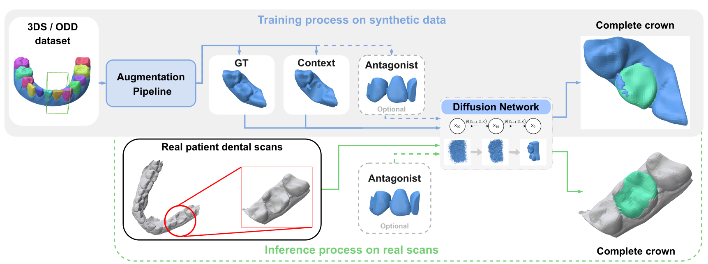

# VISAPP_ToothCraft

**ToothCraft** is a learning-based **3D tooth crown completion method** based on **diffusion models operating on Signed Distance Functions (SDFs)**.  
The method reconstructs missing or damaged tooth crowns by leveraging the geometric context of surrounding teeth.

ToothCraft is designed for dental restoration scenarios where partial tooth geometry is available and a complete crown needs to be reconstructed in a plausible way that respects local morphology and occlusion.

The model learns to generate complete tooth shapes conditioned on the **local dental arch context**, allowing it to restore crowns with different types and severities of damage.


## Installation

### 1. Clone Repo

```bash
git clone https://github.com/ikarus1211/VISAPP_ToothCraft.git
cd VISAPP_ToothCraft
```

### 2. Create a virtual environment
Conda is recommended but should work with any other virtual environment manager.
```bash
conda create -n toothcraft python=3.10
conda activate toothcraft
```

### 3. PyTorch
Install prefered version of pytorch tested with PyTorch 2.9.0. \
**Select correct CUDA version for your GPU.**

```bash
pip install torch==2.9.0 torchvision==0.24.0 torchaudio==2.9.0 --index-url https://download.pytorch.org/whl/cu126
```

### 4. Dependencies
install dependencies from requirements.txt
```bash
pip install -r requirements.txt
```

## Data
To run ToothCraft, you will need to generate SDF dataset using the provided pipeline in AugmentPipeline folder. Read the
README.md file in AugmentPipeline folder for more details.

If you want to provide your own SDF data, the context should be a cutout that includes the surrounding crowns and is
roughly twice the size of the missing tooth or the tooth that requires completion. This cutout should then be normalized
to the unit sphere and roughly aligned with the ODD arches.

**Path to dataset is specified in config .yaml files.**
## Run

Before training or testing, make sure to fill out configurations in config .yaml files for wandb logging.
### Train
```bash
python train.py --config-path "configs/train" --config-name "train_64_odd_normal.yaml"
```
### Test
```bash
python test.py --config-path "configs/test" --config-name "test_normal.yaml"
```

## Configuration
The whole method uses hydra for configuration. You can specify your own parameters in those configs or use cmd line
override as specified in hydra documentation.\
Example
```aiignore
python train.py --config-path "configs/train" --config-name "train_64_odd_normal.yaml" --exp.batch_size 16
```


## Checkpoints
Checkpoint will be published soon. The path to the checkpoint is specified in config .yaml files.

## Citation
TODO Waiting for Indexing

