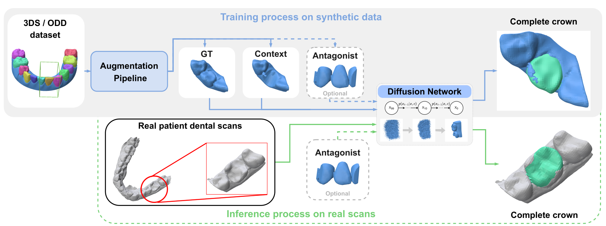

# VISAPP_ToothCraft


<p align="center">
  <a href="https://arxiv.org/abs/2603.26588">
    
  </a>
  <a href="https://genrecon3d.github.io/#accepted-papers">
    
  </a>
  <a href="https://doi.org/10.5220/0014646500004084">
    
  </a>

  <a href="https://huggingface.co/DejvaX/ToothCraft/tree/main">
    
  </a>
</p>

<p align="center">
<strong>ToothCraft</strong> is a learning-based <strong>3D tooth crown completion</strong> method built on <strong>diffusion models over Signed Distance Functions (SDFs)</strong>.
</p>

ToothCraft reconstructs missing or damaged tooth crowns from partial geometry while using the surrounding dental arch as anatomical context. The method is designed for dental restoration workflows where the completed crown should remain plausible with respect to local morphology and occlusion.

The model learns to generate complete tooth shapes conditioned on nearby teeth, which allows it to handle different tooth types and multiple levels of crown damage.

## Highlights

- Context-aware 3D tooth crown completion from partial input.
- Diffusion-based generation on Signed Distance Functions (SDFs).
- Uses local dental arch geometry to preserve morphology and occlusal surface.
- Includes a data generation pipeline for building synthetic training examples from complete arches.

## Installation

### 1. Clone Repo

```bash
git clone https://github.com/ikarus1211/VISAPP_ToothCraft.git
cd VISAPP_ToothCraft
```

### 2. Create a virtual environment
Conda is recommended, but any environment manager should work.
```bash
conda create -n toothcraft python=3.10
conda activate toothcraft
```

### 3. PyTorch
Install your preferred PyTorch build. The repository was tested with PyTorch 2.9.0. Make sure to choose the correct CUDA
version for your GPU.

```bash
pip install torch==2.9.0 torchvision==0.24.0 torchaudio==2.9.0 --index-url https://download.pytorch.org/whl/cu126
```

### 4. Install dependencies
install dependencies from requirements.txt
```bash
pip install -r requirements.txt
```


## Data
To run ToothCraft, first generate an SDF dataset using the pipeline in `AugmentPipeline/`, see the data 
[README](./AugmentPipeline/README_DATA.MD)  for the full preprocessing instructions.

If you want to provide your own SDF data, use a local context cutout that includes neighboring crowns and spans roughly 
twice the size of the missing or damaged tooth. The cutout should then be normalized to the unit sphere and approximately
aligned with the ODD arches.

**Dataset paths are configured in the corresponding `.yaml` files.**
## Run

Before training or testing, make sure to fill out configurations in config `.yaml` files for `wandb` logging.
### Train
```bash
python train.py --config-path "configs/train" --config-name "train_64_odd_normal.yaml"
```
### Test
```bash
python test.py --config-path "configs/test" --config-name "test_normal.yaml"
```

## Configuration
The project uses `hydra` for configuration management. You can edit the config files directly or override parameters from the command line.

Example:
```aiignore
python train.py --config-path "configs/train" --config-name "train_64_odd_normal.yaml" --exp.batch_size 16
```


## Checkpoints
Pretrained ToothCraft checkpoints are available on Hugging Face:

- [ToothCraft](https://huggingface.co/DejvaX/ToothCraft/tree/main)

Download the checkpoint you want to use and set its path in the corresponding `.yaml` configuration file before evaluation or inference.


## Citation

If you use this work, please cite:

```bibtex
@conference{pukanec2026toothcraft,
  author       = {Dávid Pukanec and Tibor Kubík and Michal Španěl},
  title        = {From Synthetic Data to Real Restorations: Diffusion Model for Patient-specific Dental Crown Completion},
  booktitle    = {Proceedings of the 21st International Conference on Computer Vision Theory and Applications - Volume 1: VISAPP},
  year         = {2026},
  pages        = {734--742},
  publisher    = {SciTePress},
  organization = {INSTICC},
  doi          = {10.5220/0014646500004084},
  isbn         = {978-989-758-804-4}
}
```
